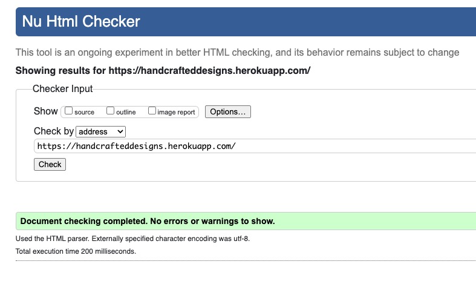
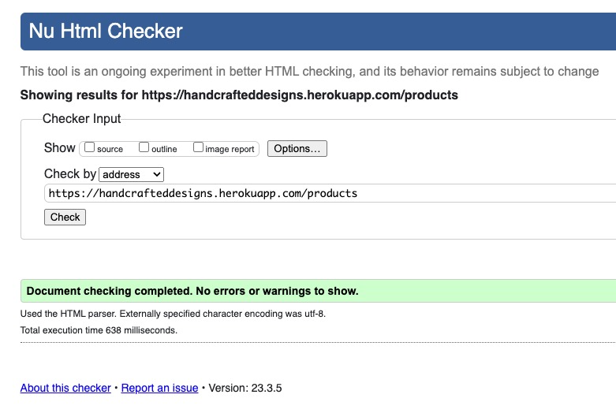
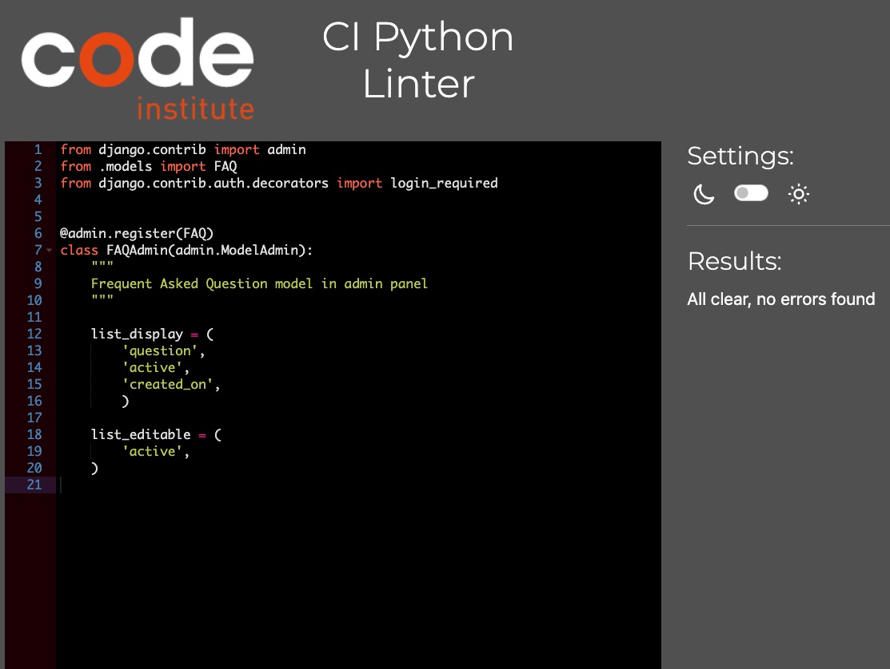
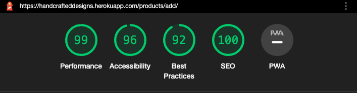
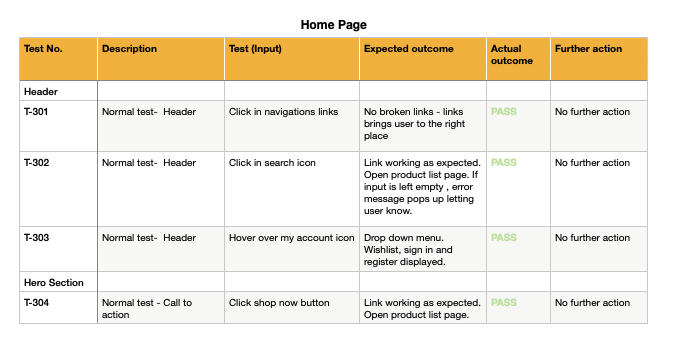
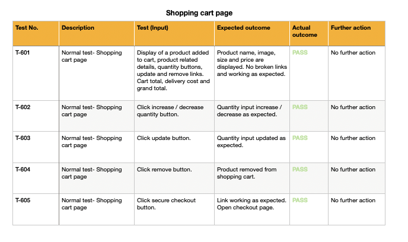

## Html checker

- 

  
Homepage

  - 

  

- 

  
Product List

  - 

  

- 

  
Product Detail

  - 

  

- 

  
Add Product

  - 

  

- 

  
Edit Product

  - 

  

- 

  
Delete Product

  - 

  

- 

  
Product Wishlist

  - 

  

- 

  
Cart Page

  - 

  

- 

  
Checkout Page

  - 

  

- 

  
Blog Page

  - 

  

- 

  
Blog Article Page

  - 

  

- 

  
Update Article Page

  - 

  

- 

  
Delete Article Page

  - 

  

- 

  
About Page

  - 

  

- 

  
FAQs Page

  - 

  

- 

  
Contact Us Page

  - 

  

- 

  
Profile Page

  - 

  

## CSS validator

- 

  
Homepage

  - 
  
  

- 

  
Product List

  - 
  
  

- 

  
Product Detail

  - 
  
  

- 

  
Edit Product

  - 
  
  

- 

  
Delete Product

  - 
  
  

- 

  
Product Wishlist

  - 
  
  

- 

  
Cart

  - 
  
  

- 

  
Checkout

  - 
  
  

- 

  
Blog Page

  - 
  
  

- 

  
Blog Article Page

  - 
  
  

- 

  
Update Article Page

  - 
  
  

- 

  
About

  - 
  
  

- 

  
FAQs

  - 
  
  

- 

  
Contact

  - 
  
  

## CI PEP8 linter

- 

  
Settings urlpatterns linter

  - 
  
  

- 

  
Settings linter

  - 
  
  

- 

  
Blog views linter

  - 
  
  

- 

  
Blog model linter

  - 
  
  

- 

  
Blog forms linter

  - 
  
  

- 

  
Blog admin linter

  - 
  
  

- 

  
Blog urls linter

  - 
  
  

- 

  
Cart views linter

  - 
  
  

- 

  
Cart urls linter

  - 
  
  

- 

  
Cart context linter

  - 
  
  

- 

  
Checkout webhooks linter

  - 
  
  

- 

  
Checkout webhook handler linter

  - 
  
  

- 

  
Checkout views linter

  - 
  
  

- 

  
Checkout urls linter

  - 
  
  

- 

  
Checkout signals linter

  - 
  
  

- 

  
Checkout models linter

  - 
  
  

- 

  
Checkout forms linter

  - 
  
  

- 

  
Checkout admin linter

  - 
  
  

- 

  
Home views linter

  - 
  
  

- 

  
Home urls linter

  - 
  
  

- 

  
Home models linter

  - 
  
  

- 

  
Home forms linter

  - 
  
  

- 

  
Home admin linter

  - 
  
  

- 

  
Products widgets linter

  - 
  
  

- 

  
Products views linter

  - 
  
  

- 

  
Products urls linter

  - 
  
  

- 

  
Products models linter

  - 
  
  

- 

  
Products forms linter

  - 
  
  

- 

  
Products admin linter

  - 
  
  

- 

  
Profiles views linter

  - 
  
  

- 

  
Profiles urls linter

  - 
  
  

- 

  
Profiles models linter

  - 
  
  

- 

  
Profiles forms linter

  - 
  
  

## Lighthouse testing

- 

  
Homepage lighthouse test

  - 
  
  

- 

  
Product list lighthouse test

  - 
  
  

- 

  
Product detail lighthouse test

  - 
  
  

- 

  
Add Product lighthouse test

  - 
  
  

- 

  
Edit Product lighthouse test

  - 
  
  

- 

  
Product wishlist lighthouse test

  - 
  
  

- 

  
Cart lighthouse test

  - 
  
  

- 

  
Checkout lighthouse test

  - 
  
  

- 

  
Blog lighthouse test

  - 
  
  

- 

  
Blog article lighthouse test

  - 
  
  

- 

  
Update blog article lighthouse test

  - 
  
  

- 

  
About page lighthouse test

  - 
  
  

- 

  
Contact Us lighthouse test

  - 
  
  

- 

  
FAQs lighthouse test

  - 
  
  

- 

  
My Profile lighthouse test

  - 
  
  

## Contrast checker

- 

  
Contrast checker

  - 
  
  

## Manual testing

- 

  
Registration/ login/ logout manual testing

  - 
  
  

- 

  
Unauthenticated user homepage

  - 
  
  

- 

  
Unauthenticated user product list

  - 
  
  

- 

  
Unauthenticated user product detail

  - 
  
  

- 

  
Unauthenticated user shopping cart

  - 
  
  

- 

  
Unauthenticated user checkout

  - 
  
  

- 

  
Unauthenticated user blog article list

  - 
  
  

- 

  
Unauthenticated user blog article detail

  - 
  
  

- 

  
Unauthenticated user FAQs page

  - 
  
  

- 

  
Authenticated user top navigation

  - 
  
  

- 

  
Authenticated user product list

  - 
  
  

- 

  
Authenticated user product detail

  - 
  
  

- 

  
Authenticated user checkout page

  - 
  
  

- 

  
Authenticated user blog article list

  - 
  
  

  
- 

  
Authenticated user blog article detail

  - 
  
  

- 

  
Authenticated user contact page

  - 
  
  

- 

  
Authenticated user profile page

  - 
  
  

## JsHint

- 

  
Jshint Stripe Elements

  - 

  

- 

  
Jshint New Image

  - 

  

- 

  
Jshint Scroll to Top

  - 

  

- 

  
Jshint update / remove item

  - 

  

- 

  
Jshint handle enable disable quantity

  - 

  

- 

  
Jshint search sort and direction

  - 

  

- 

  
Jshint country fields

  - 

  

## Automated Tests

- 

  
Unit Testing coverage report

  - 
  
  - Failed tests:
  
    - 
  
  

